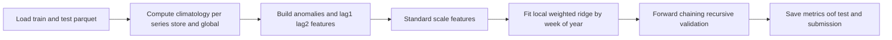
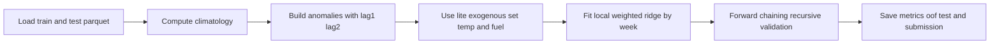
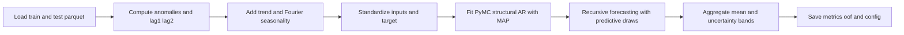
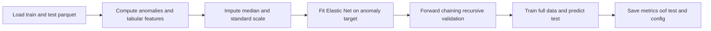
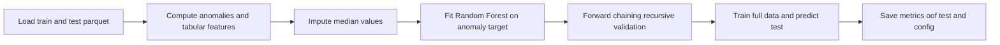
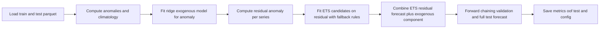
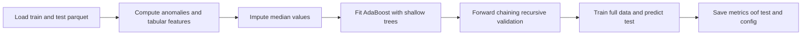

# Walmart Weekly Sales Forecasting

This project compares six forecasting models for Walmart weekly sales using the same forward-chaining validation protocol and WMAE as the primary metric.

Models in scope:
- Phase 1: Local Linear anomaly model.
- Phase 2: Bayesian Structural AR (PyMC).
- Phase 3: Elastic Net anomaly baseline.
- Phase 4: Random Forest anomaly baseline.
- Phase 5: ETS anomaly baseline (with exogenous residual correction).
- Phase 6: AdaBoost anomaly baseline.

## Environment

From project root:

```powershell
cd "C:\Users\LENOVO\Documents\machine_learning_utec\Regression_Challenge_3-Walmart\walmart-recruiting-store-sales-forecasting"
```

Activate your virtual environment (example):

```powershell
.venv\Scripts\activate
```

## Run All Models

All commands below use the hyperparameters saved in `outputs/*/config*.json` for reproducibility.

### Phase 1 (Local Linear, full exogenous interface)

```powershell
python scripts/phase1_local_linear.py `
  --train-path train_feat.parquet `
  --test-path test_feat.parquet `
  --output-dir outputs `
  --kernel tricube `
  --bandwidth 6 `
  --min-samples 16 `
  --ridge 1e-4 `
  --coef-clip 6.0 `
  --anom-clip-scale 2.0 `
  --n-folds 4 `
  --val-weeks 13 `
  --feature-mode full `
  --no-use-interactions
```

Saved run config:
- `outputs/metrics/local_linear_config.json`

Mermaid workflow:



### Phase 1-lite (diagnostic variant)

```powershell
python scripts/phase1_local_linear.py `
  --train-path train_feat.parquet `
  --test-path test_feat.parquet `
  --output-dir outputs/phase1_local_linear_lite `
  --kernel tricube `
  --bandwidth 6 `
  --min-samples 16 `
  --ridge 1e-4 `
  --coef-clip 6.0 `
  --anom-clip-scale 2.0 `
  --n-folds 4 `
  --val-weeks 13 `
  --feature-mode lite `
  --no-use-interactions
```

Saved run config:
- `outputs/phase1_local_linear_lite/metrics/local_linear_config.json`

Mermaid workflow:



### Phase 2 (Bayesian Structural AR, full data)

```powershell
python scripts/phase2_structural_ar.py `
  --train-path train_feat.parquet `
  --test-path test_feat.parquet `
  --output-dir outputs/phase2_structural_ar_full `
  --n-folds 4 `
  --val-weeks 13 `
  --max-eval 1800 `
  --random-seed 8927 `
  --pred-draws 40 `
  --fourier-order 3 `
  --sigma-clusters 0 `
  --max-series 3331
```

Saved run config:
- `outputs/phase2_structural_ar_full/metrics/structural_ar_config.json`

Mermaid workflow:



### Phase 3 (Elastic Net)

```powershell
python scripts/phase3_elastic_net.py `
  --train-path train_feat.parquet `
  --test-path test_feat.parquet `
  --output-dir outputs/baselines/elastic_net `
  --n-folds 4 `
  --val-weeks 13 `
  --alpha 0.02 `
  --l1-ratio 0.2 `
  --max-iter 10000
```

Saved run config:
- `outputs/baselines/elastic_net/config.json`

Mermaid workflow:



### Phase 4 (Random Forest)

```powershell
python scripts/phase4_random_forest.py `
  --train-path train_feat.parquet `
  --test-path test_feat.parquet `
  --output-dir outputs/baselines/random_forest `
  --n-folds 4 `
  --val-weeks 13 `
  --n-estimators 120 `
  --max-depth 18 `
  --min-samples-leaf 2 `
  --max-features sqrt
```

Saved run config:
- `outputs/baselines/random_forest/config.json`

Mermaid workflow:



### Phase 5 (ETS + exogenous residual)

```powershell
python scripts/phase5_ets.py `
  --train-path train_feat.parquet `
  --test-path test_feat.parquet `
  --output-dir outputs/baselines/ets `
  --n-folds 4 `
  --val-weeks 13 `
  --seasonal-periods 52 `
  --exog-alpha 1.0
```

Saved run config:
- `outputs/baselines/ets/config.json`

Mermaid workflow:



### Phase 6 (AdaBoost)

```powershell
python scripts/phase6_adaboost.py `
  --train-path train_feat.parquet `
  --test-path test_feat.parquet `
  --output-dir outputs/baselines/adaboost `
  --n-folds 4 `
  --val-weeks 13 `
  --n-estimators 300 `
  --learning-rate 0.03 `
  --max-depth 3 `
  --loss linear
```

Saved run config:
- `outputs/baselines/adaboost/config.json`

Mermaid workflow:



## Why These Hyperparameters

These values are the reproducible settings used for the current report artifacts and were selected to balance forward-chaining WMAE, numerical stability, and runtime.

- Phase 1 (Local Linear):
  - `kernel=tricube`, `bandwidth=6`, `min_samples=16` keep local seasonality smooth but not too noisy.
  - `ridge=1e-4`, `coef_clip=6.0` stabilize per-week local regressions.
  - `anom_clip_scale=2.0` limits recursive drift in long horizons.
  - `standard_scaler=true` keeps exogenous magnitudes comparable.
- Phase 2 (Structural AR):
  - `max_eval=1800` gives MAP optimization enough steps without extreme runtime.
  - `pred_draws=40` provides uncertainty estimation with manageable cost.
  - `fourier_order=3` captures annual seasonality without overfitting.
  - `sigma_clusters=0` keeps a single noise scale for stable full-data fitting.
  - `max_series=3331` means the full set of store-dept series is used.
- Phase 3 (Elastic Net):
  - `alpha=0.02`, `l1_ratio=0.2` favor mostly ridge-like shrinkage with light sparsity.
  - `max_iter=10000` prevents early convergence issues.
- Phase 4 (Random Forest):
  - `n_estimators=120` improves averaging while keeping runtime practical.
  - `max_depth=18`, `min_samples_leaf=2` allow nonlinearity while controlling variance.
  - `max_features=sqrt` is a strong default for tree de-correlation.
- Phase 5 (ETS):
  - `seasonal_periods=52` matches weekly annual cycle.
  - `exog_alpha=1.0` provides moderate ridge regularization for exogenous residual correction.
- Phase 6 (AdaBoost):
  - `n_estimators=300`, `learning_rate=0.03` use many weak updates with conservative step size.
  - `max_depth=3` keeps base trees weak enough for boosting.
  - `loss=linear` is the robust baseline loss.

## Report and Notebook Export

`report/model_comparison_notebook_ready.qmd` contains everything needed to build an `.ipynb` version:
- all explanations and insights,
- mermaid workflows,
- self-contained training cells (model-by-model),
- no dependency on importing local `.py` files from the notebook.

Render it with:

```powershell
quarto render report/model_comparison_notebook_ready.qmd
```

Main comparison report:
- `report/model_comparison.qmd`
- `report/model_comparison.html`
